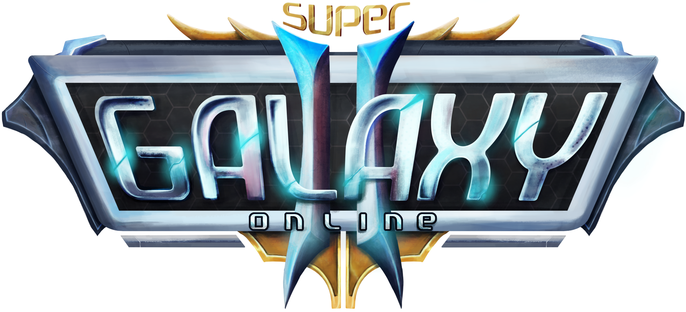
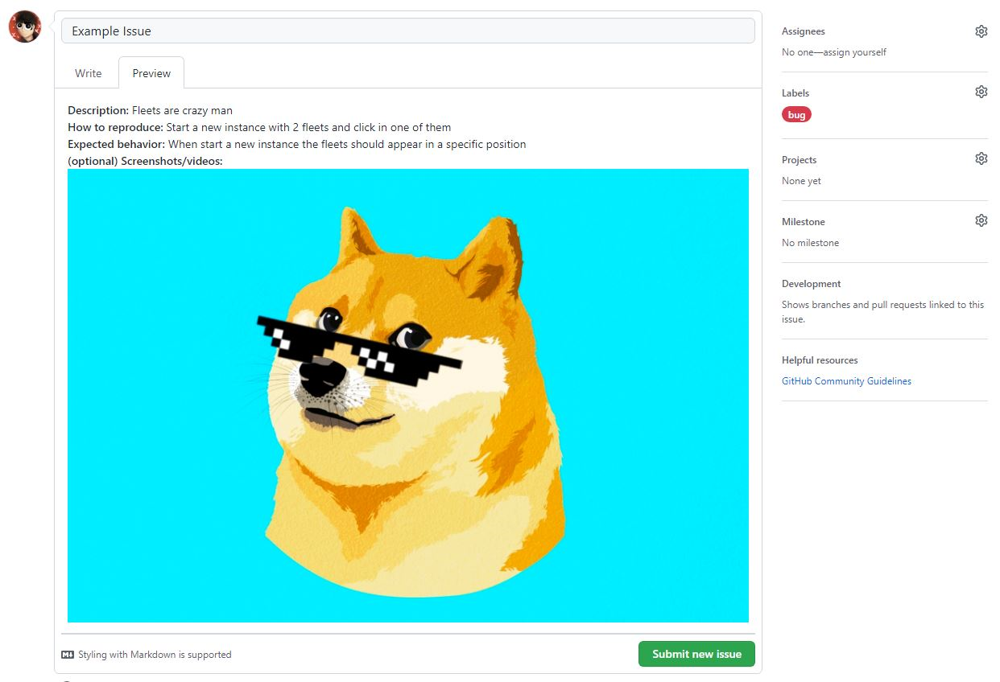

[![Stargazers][stars-shield]][stars-url]
[![Issues][issues-shield]][issues-url]
[![Discord][discord-shield]][discord-url]
[![Version][version-shield]][version-url]

<!-- PROJECT LOGO -->
 

  

  <h3 align="center">SuperGO2 - A New Galaxy Awakens</h3>

  

    A server emulation of the old MMO flash game called Galaxy Online II
     
    <a href="https://github.com/SuperGO2/supergo2-issues/releases"><strong>Explore releases »</strong></a>
     
     
    <a href="https://supergo2.com">Official Website</a>
    ·
    <a href="https://github.com/SuperGO2/supergo2-issues/issues">Report Bug</a>
    ·
    <a href="https://github.com/SuperGO2/supergo2-issues/issues">Make a Suggestion</a>
  

<!-- TABLE OF CONTENTS -->

  
Table of Contents

  <ol>
    <li><a href="#about-the-project">About The Project</a></li>
    <li><a href="#play-(beta)">Play (Beta)</a>
      <ul>
        <li><a href="#windows">Windows</a></li>
        <li><a href="#macos">MacOS</a></li>
        <li><a href="#linux">Linux</a></li>
        <li><a href="#android-&-ios">Android & iOS</a></li>
      </ul>
    </li>
    <li><a href="#report-bug">Report Bug</a></li>
    <li><a href="#roadmap">Roadmap</a></li>
    <li><a href="#join-the-team">Join the team</a></li>
    <li><a href="#contact">Contact</a></li>
    <li><a href="#interest-links">Interest Links</a></li>
  </ol>

<!-- ABOUT THE PROJECT -->
## About The Project

SuperGO2 is a server emulation of the old MMO flash game called Galaxy Online II, in this way the purpose of the project is to revive the game and help the entire community and players who enjoyed this excellent MMO to endure, also even if that is not enough, we have the hope of being able to improve the game, adding blueprints, commanders, constellations and more content than what it currently has and which remains the same content throughout all these years.

Read the `Play` section of this guide to know how to play the game.

(<a href="#top">back to top</a>)

<!-- GETTING STARTED -->
## Play (Beta)

> For play the beta you need to have a generated account. This account can only be obtainable if you are a qualified battle-reviewer, or during the closed beta draw that would be announced via discord when that phase starts.

Here is a small guide on how to run the game on different operating systems.

### Windows

Play with our custom launcher:

1. Find the windows executable in the releases tab or [click here](https://github.com/SuperGO2/supergo2-issues/releases).
2. Download the `.exe` installer and run the installation.
3. If windows shows you a popup with `Microsoft Defender SmartScreen prevented an unrecognized app from starting.`, just click on _More info_ and then click on **Run anyway**. This is required because the application does not have a verified developer identity.
4. Open the game and enjoy!

Play with Flash Browser:

1. Go to Flash Browser website or [click here](https://flash.pm/browser/).
2. Download the `.exe` installer and run the installation.
3. Open the browser and in a new tab type https://beta.supergo2.com.

### MacOS

Play with our custom launcher:

1. Find the MacOS executable in the releases tab or [click here](https://github.com/SuperGO2/supergo2-issues/releases).
2. Download the `.dmg` installer and run the installation.
3. If the OS requests you to give permissions you need to enable them from the system permissions. This is required because the application does not have a verified developer identity.
4. Open the game and enjoy!

Play with Flash Browser:

1. Go to Flash Browser website or [click here](https://flash.pm/browser/).
2. Download the `.dmg` installer and run the installation.
3. Open the browser and in a new tab type https://beta.supergo2.com.

### Linux

Play with our custom launcher:

1. Find the Linux executable in the releases tab or [click here](https://github.com/SuperGO2/supergo2-issues/releases).
2. Download the `.AppImage` executable and run it.

### Android & iOS

Play with Puffin:

1. Open Play Store / App Store and find `Puffin Web Browser`.
2. Install the application and open it.
3. In a new tab type https://beta.supergo2.com.

(<a href="#top">back to top</a>)

<!-- USAGE EXAMPLES -->
## Report Bug

See the [open issues](https://github.com/SuperGO2/supergo2-issues/issues) for a full list of proposed features (and known issues). There you can open a new issue and is required that you follow the next format for bugs:

_For more information, please refer to the [Documentation](https://github.com/SuperGO2/supergo2-issues/wiki)_

(<a href="#top">back to top</a>)

<!-- ROADMAP -->
## Roadmap

- [x] Development Phase **« Current here**
- [ ] Closed Alpha Phase
- [ ] Open Alpha Phase
- [ ] Beta Phase

(<a href="#top">back to top</a>)

<!-- CONTRIBUTING -->
## Join the team

If you want to belong to the team you can contact us through the email that we leave in the contact section, send us why you are interested in participating, in which area you specialize; design, sound, programming, or send us your CV. We are very grateful to those who collaborate with us because together we make this project go ahead and in the future become a great project!

(<a href="#top">back to top</a>)

<!-- CONTACT -->
## Contact

Game Support - support@supergo2.com

Project Link: [https://github.com/SuperGO2/supergo2-issues](https://github.com/SuperGO2/supergo2-issues)

(<a href="#top">back to top</a>)

<!-- ACKNOWLEDGMENTS -->
## Interest Links

Below is a list of useful links regarding the project.

* [Official Website](https://supergo2.com){:target="_blank"}
* [Beta Website](https://beta.supergo2.com){:target="_blank"}
* [Launcher Releases](https://github.com/SuperGO2/supergo2-issues/releases){:target="_blank"}
* [GO2 Fandom](https://galaxyonlineii.fandom.com){:target="_blank"}
* [KrTools](https://krtools.deajae.co.uk){:target="_blank"}
* [Discord](https://discord.gg/ApPQErfvJw){:target="_blank"}
* [Facebook](https://www.facebook.com/supergo2){:target="_blank"}

(<a href="#top">back to top</a>)

<!-- MARKDOWN LINKS & IMAGES -->
<!-- https://www.markdownguide.org/basic-syntax/#reference-style-links -->
[stars-shield]: https://img.shields.io/github/stars/SuperGO2/supergo2-issues.svg?style=for-the-badge
[stars-url]: https://github.com/SuperGO2/supergo2-issues/stargazers
[issues-shield]: https://img.shields.io/github/issues/SuperGO2/supergo2-issues.svg?style=for-the-badge
[issues-url]: https://github.com/SuperGO2/supergo2-issues/issues
[discord-shield]: https://img.shields.io/discord/777841529821331487?logo=discord&logoColor=white&style=for-the-badge
[discord-url]: https://discord.gg/ApPQErfvJw
[version-shield]: https://img.shields.io/badge/Version-v2022.2.pro--dev-blueviolet?logo=data:image/svg%2bxml;base64,PHN2ZyB4bWxucz0iaHR0cDovL3d3dy53My5vcmcvMjAwMC9zdmciIHZlcnNpb249IjEiIHdpZHRoPSI2MDAiIGhlaWdodD0iNjAwIj48cGF0aCBkPSJNMTI5IDExMWMtNTUgNC05MyA2Ni05MyA3OEwwIDM5OGMtMiA3MCAzNiA5MiA2OSA5MWgxYzc5IDAgODctNTcgMTMwLTEyOGgyMDFjNDMgNzEgNTAgMTI4IDEyOSAxMjhoMWMzMyAxIDcxLTIxIDY5LTkxbC0zNi0yMDljMC0xMi00MC03OC05OC03OGgtMTBjLTYzIDAtOTIgMzUtOTIgNDJIMjM2YzAtNy0yOS00Mi05Mi00MmgtMTV6IiBmaWxsPSIjZmZmIi8+PC9zdmc+&logoColor=white&style=for-the-badge
[version-url]: https://discord.gg/ApPQErfvJw
