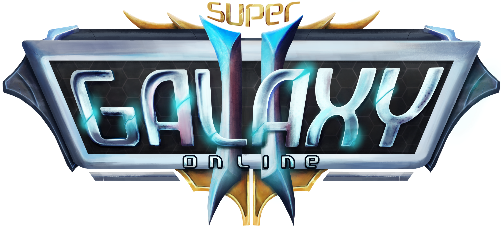
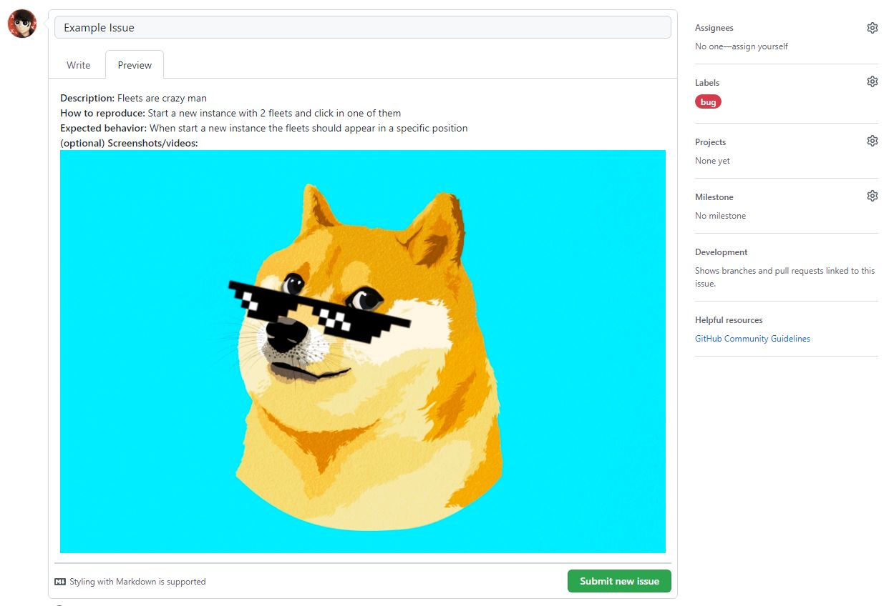

[![Stargazers][stars-shield]][stars-url]
[![Issues][issues-shield]][issues-url]
[![Discord][discord-shield]][discord-url]
[![Version][version-shield]][version-url]

<!-- PROJECT LOGO -->
 

  

  <h3 align="center">SuperGO2 - Una Nueva Galaxia Despierta</h3>

  

    Un servidor privado del viejo juego flash MMO Galaxy Online II
     
    <a href="https://github.com/SuperGO2/supergo2-issues/releases"><strong>Descargas »</strong></a>
     
     
    <a href="https://supergo2.com">Sitio Web Oficial</a>
    ·
    <a href="https://github.com/SuperGO2/supergo2-issues/issues">Reportar Bugs</a>
    ·
    <a href="https://github.com/SuperGO2/supergo2-issues/issues">Realizar Sugerencias</a>
  

<!-- TABLE OF CONTENTS -->

  
Tabla de Contenidos

  <ol>
    <li><a href="#about-the-project">Acerca del Proyecto</a></li>
    <li><a href="#play-beta">Jugar (Closed-Alpha)</a>
      <ul>
        <li><a href="#windows">Windows</a></li>
        <li><a href="#macos">MacOS</a></li>
        <li><a href="#linux">Linux</a></li>
        <li><a href="#android-&-ios">Android & iOS</a></li>
      </ul>
    </li>
    <li><a href="#report-bug">Reportar un Bug</a></li>
    <li><a href="#roadmap">Fases</a></li>
    <li><a href="#join-the-team">Entrar al Equipo</a></li>
    <li><a href="#contact">Contacto</a></li>
    <li><a href="#interest-links">Enlaces de Interés</a></li>
  </ol>

<!-- ABOUT THE PROJECT -->
## Acerca del Proyecto

SuperGO2 es un servidor privado del antiguo juego flash MMO llamado Galaxy Online II, de esta manera el propósito del proyecto es revivir el juego y ayudar a toda la comunidad y jugadores que disfrutaron de este excelente MMO a perdurar, incluso si eso no es suficiente, tenemos la esperanza de poder mejorar el juego, añadiendo planos, comandantes, constelaciones y más contenido con el tiempo.
Lea la sección `Jugar` de esta guía para saber cómo jugar el juego.

(<a href="#top">subir</a>)

<!-- GETTING STARTED -->
## Jugar (Closed-Alpha)

Para jugar el Alfa Cerrado necesitas tener una cuenta generada. Esta cuenta solo se puede obtener si cumple alguna de las siguientes condiciones:

- Si es un patreon que donó en cualquiera de los 3 tiers y en cualquiera momento antes del 31 de mayo del presente año. 
- Si boosteo el Discord oficial antes del 31 de mayo del presente año. 
- Si posee el rol Battle Reviewer. 
- Si posee el rol Influencer. 
- Cualquier miembro del Staff. 
- También, en los próximos 3 meses, se harán varios sorteos en el Discord, donde siempre habrán 3 ganadores que obtendrán una cuenta para jugar.

> Cualquiera que tenga acceso a la fase closed-alpha tendrá un rol adicional en Discord que se llamará @Alpha Tester.

A continuación una pequeña guia para jugar en los diferentes sistemas operativos

### Windows

Juega con nuestro Launcher personalizado:

1. Busca un ejecutable para Windows en la sección de descargas o [haz click aquí](https://github.com/SuperGO2/supergo2-issues/releases).
2. Descarga el instalador en formato `.exe` y ejecuta la instalación.
3. Si windows te muestra un mensaje de advertencia diciendo `Microsoft Defender SmartScreen impidió que se iniciara una aplicación no reconocida.`, simplemente dale en _Mas Información_ y luego click en **Ejecutar de todas formas**. Esto es requerido debido a que la aplicación no cuenta con una identidad de desarrollo verificada.
4. Abre el juego, ingresa tus datos y disfruta!

Jugar con Flash Browser:

1. Ve al sitio web de Flash Browser o [haz click aquí](https://flash.pm/browser/).
2. Descarga el instalador en formato `.exe` y ejecuta la instalación.
3. Abre el navegador y en una nueva pestaña escribe https://beta.supergo2.com.

### MacOS

Juega con nuestro Launcher personalizado:

1. Busca un ejecutable para MacOS en la sección de descargas o [haz click aquí](https://github.com/SuperGO2/supergo2-issues/releases).
2. Descarga el instalador en formato `.dmg` y ejecuta la instalación.
3. Si el sistema operativo te pide permisos debes darselos desde el panel de permisos. Esto es requerido debido a que la aplicación no cuenta con una identidad de desarrollo verificada.
4. Abre el juego, ingresa tus datos y disfruta!

Jugar con Flash Browser:

1. Ve al sitio web de Flash Browser o [haz click aquí](https://flash.pm/browser/).
2. Descarga el instalador en formato `.dmg` y ejecuta la instalación.
3. Abre el navegador y en una nueva pestaña escribe https://beta.supergo2.com.

### Linux

Juega con nuestro Launcher personalizado:

1. Busca un ejecutable para Linux en la sección de descargas o [haz click aquí](https://github.com/SuperGO2/supergo2-issues/releases).
2. Descarga el instalador en formato `.AppImage` y ejecuta la instalación.
3. Abre el juego, ingresa tus datos y disfruta!

### Android & iOS

Juega con Puffin:

1. Abre la Play Store / App Store y busca `Puffin Web Browser`.
2. Instala la aplicación y ejecutala.
3. Abre una pestaña y escribe https://beta.supergo2.com.

(<a href="#top">subir</a>)

<!-- USAGE EXAMPLES -->
## Reportar un Bug

Puedes [hacer click aquí](https://github.com/SuperGO2/supergo2-issues/issues) para la lista completa de sugerencias (y problemas conocidos). Allí puedes iniciar un nuevo hilo para reportar un bug siempre y cuando sigas el siguiente formato:

_Para mas información, por favor revisa la [Documentación](https://github.com/SuperGO2/supergo2-issues/wiki)_

(<a href="#top">subir</a>)

<!-- ROADMAP -->
## Fases

- [x] Fase de desarrollo (Development)
- [x] Fase de Alpha Cerrada (Closed-Alpha) **« Actualmente aquí**
- [ ] Fase de Alpha Abierta (Open-Alpha)
- [ ] Fase Beta (Open-Beta)

(<a href="#top">subir</a>)

<!-- CONTRIBUTING -->
## Forma parte del Equipo

Si quieres pertenecer al equipo puedes contactarnos a través del correo electrónico que te dejamos en la sección de contacto, envíanos por qué te interesa participar, en qué área te especializas; diseño, sonido, programación, o envíanos tu CV. ¡Estamos muy agradecidos con quienes colaboran con nosotros porque juntos hacemos que este proyecto salga adelante y en el futuro se convierta en un gran proyecto!

(<a href="#top">subir</a>)

<!-- CONTACT -->
## Contacto

Soporte - support@supergo2.com

Enlace del Proyecto: [https://github.com/SuperGO2/supergo2-issues](https://github.com/SuperGO2/supergo2-issues)

(<a href="#top">subir</a>)

<!-- ACKNOWLEDGMENTS -->
## Enlaces de Interés

A continuación, una lista de enlaces utiles referentes al proyecto:

* [Sitio Web Oficial](https://supergo2.com)
* [Sitio Web Beta](https://beta.supergo2.com)
* [Descargas](https://github.com/SuperGO2/supergo2-issues/releases)
* [GO2 Fandom](https://galaxyonlineii.fandom.com)
* [KrTools](https://krtools.deajae.co.uk)
* [Discord](https://discord.gg/ApPQErfvJw)
* [Facebook](https://www.facebook.com/supergo2)

(<a href="#top">subir</a>)

<!-- MARKDOWN LINKS & IMAGES -->
<!-- https://www.markdownguide.org/basic-syntax/#reference-style-links -->
[stars-shield]: https://img.shields.io/github/stars/SuperGO2/supergo2-issues.svg?style=for-the-badge
[stars-url]: https://github.com/SuperGO2/supergo2-issues/stargazers
[issues-shield]: https://img.shields.io/github/issues/SuperGO2/supergo2-issues.svg?style=for-the-badge
[issues-url]: https://github.com/SuperGO2/supergo2-issues/issues
[discord-shield]: https://img.shields.io/discord/777841529821331487?logo=discord&logoColor=white&style=for-the-badge
[discord-url]: https://discord.gg/ApPQErfvJw
[version-shield]: https://img.shields.io/badge/Version-v2022.2.pro--dev-blueviolet?logo=data:image/svg%2bxml;base64,PHN2ZyB4bWxucz0iaHR0cDovL3d3dy53My5vcmcvMjAwMC9zdmciIHZlcnNpb249IjEiIHdpZHRoPSI2MDAiIGhlaWdodD0iNjAwIj48cGF0aCBkPSJNMTI5IDExMWMtNTUgNC05MyA2Ni05MyA3OEwwIDM5OGMtMiA3MCAzNiA5MiA2OSA5MWgxYzc5IDAgODctNTcgMTMwLTEyOGgyMDFjNDMgNzEgNTAgMTI4IDEyOSAxMjhoMWMzMyAxIDcxLTIxIDY5LTkxbC0zNi0yMDljMC0xMi00MC03OC05OC03OGgtMTBjLTYzIDAtOTIgMzUtOTIgNDJIMjM2YzAtNy0yOS00Mi05Mi00MmgtMTV6IiBmaWxsPSIjZmZmIi8+PC9zdmc+&logoColor=white&style=for-the-badge
[version-url]: https://supergo2.com
